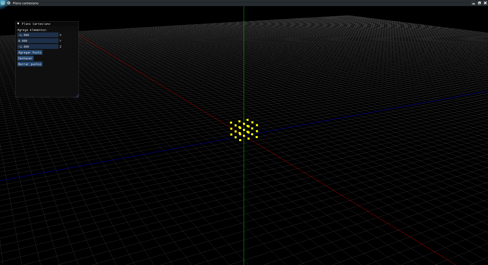

# Plano Cartesiano 3D

An interactive 3D Cartesian plane built with C++ and OpenGL, featuring a real-time GUI to add and remove points in 3D space.

## Features
- 3D grid with X, Y, Z axes (red, green, blue)
- Camera rotation with click and drag
- Zoom with mouse scroll
- ImGui panel to add points by coordinates
- Undo last point or clear all points

## Controls
| Input | Action |
|-------|--------|
| Click + Drag | Rotate camera |
| Scroll | Zoom in/out |

## How to compile

### Dependencies
```bash
sudo pacman -S glfw-x11 glew glu
```

### Compile
```bash
g++ Plano.cpp imgui/imgui.cpp imgui/imgui_draw.cpp imgui/imgui_tables.cpp imgui/imgui_widgets.cpp imgui/imgui_impl_glfw.cpp imgui/imgui_impl_opengl2.cpp -Iimgui -o Plano -lGL -lGLEW -lglfw -lGLU
```

### Run
```bash
./Plano
```

## Built With
- C++
- OpenGL + GLU
- GLFW
- GLEW
- ImGui
# CartesianPlane

